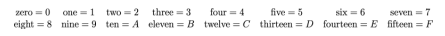

# Converting to hex

We are now really starting to unpack this business of numbers and representation and starting to get a sense of how the representation of a mathematical object is not the same as the mathematical object.  

This disconnection between objects and their representation was articulated by Plato in his Theory of Forms, which he explained through his allegory of the cave.  Plato argues that people untutored in the Theory of Forms are like prisoners chained in a cave who are unable to turn their heads.  All they can see is the wall of the cave on which the shadows of objects are cast.  The prisoners talk about these shadows as if they are the things that they are referring to.  Those educated in the Theory of Forms, however, know that they are not seeing the real objects.  They are instead seeing the shadows cast by the objects.  Plato thus argues that the common nouns we use in language are not the names of physical objects that we can see.  They are actually names of things that we cannot see, things that we can only grasp with the mind.  

We can what Plato is talking about when we consider the new conception of number that we have obtained from performing the last few tasks.  We can only say that 111 is the number one hundred and eleven because we have been brought up in a culture that reveres base ten.  This set of symbols might, however, represent the number seven in base two.

Digressions about the history of western philosophy aside we are, in this exercise, going to consider to learn how to write numbers in base 16 (which is known as hexadecimal or hex).  There is an immediate problem here - we only have 10 symbols in the Arabic number system (0,1,2,3,4,5,6,7,8,9) To operate in base 16, however, we need 16 symbols so we need to supplement our Arabic number system with additional symbols.  We thus represent the first 16 numbers as follows:



__To complete this task you must finish the function c`onvertToHex`__. This function takes an integer, `N`, that is less than 69905 as input.  When you have completed it should return a list with 5 elements.  These five numbers are the five digits of the number in hex.  As letters are used when representing numbers in hexidecimal you cannot use a numpy array here but have to use a python list here.  To create a python list and assign the elements of it you will need to write code such as the one given below:

````
mylist = 5*["0"]
mylist[0] = str(1) # converts the number 1 to a string
b = 4
mylist[1] = str(b) # converts the integer in the variable b to a string
mylist[2] = "A"  
mylist[3] = "B"   # Ensures these elements are set to A, B and C
mylist[4] = "C"
````
